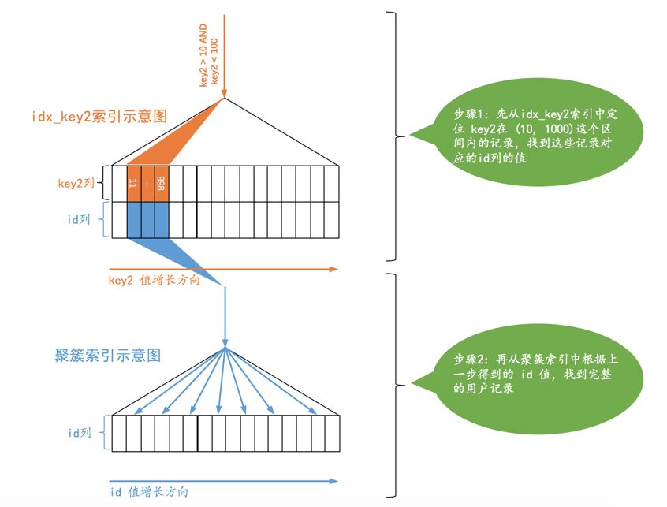
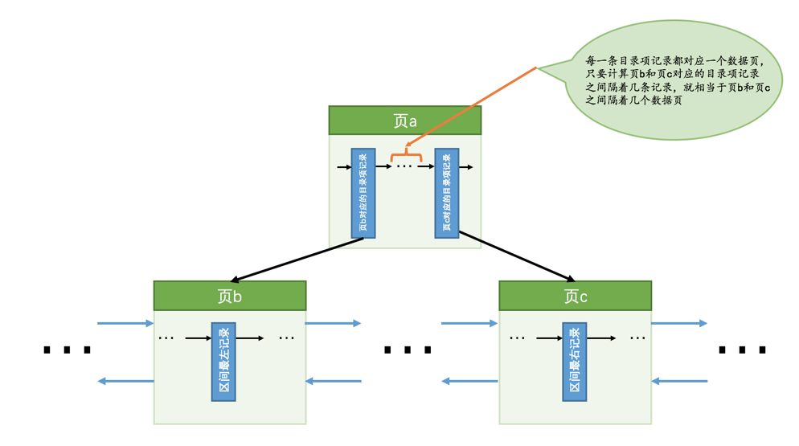
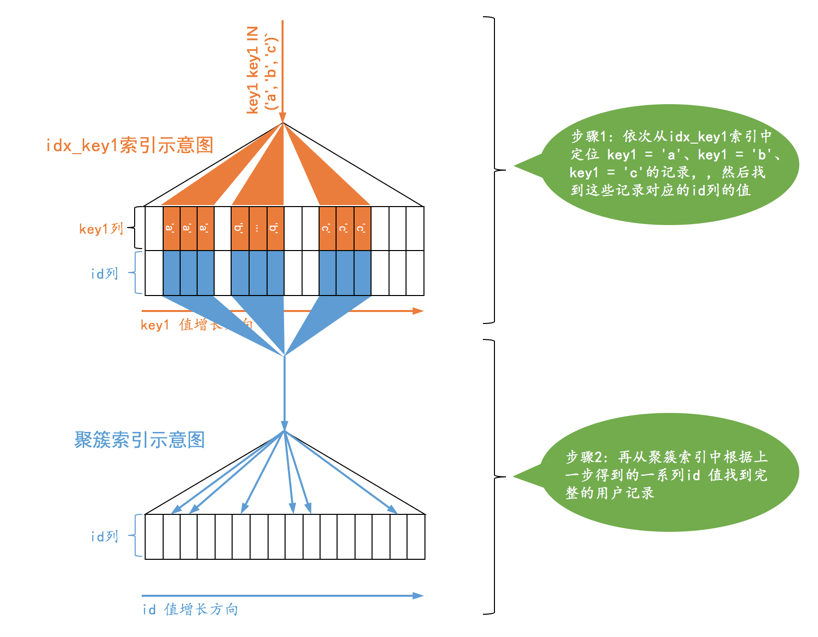

# 第12章 谁最便宜就选谁-MySQL基于成本的优化
## 什么是成本
&emsp;&emsp;我们之前老说`MySQL`执行一个查询可以有不同的执行方案，它会选择其中成本最低，或者说代价最低的那种方案去真正的执行查询。不过我们之前对`成本`的描述是非常模糊的，其实在`MySQL`中一条查询语句的执行成本是由下面这两个方面组成的：

- `I/O`成本

    &emsp;&emsp;我们的表经常使用的`MyISAM`、`InnoDB`存储引擎都是将数据和索引都存储到磁盘上的，当我们想查询表中的记录时，需要先把数据或者索引加载到内存中然后再操作。这个从磁盘到内存这个加载的过程损耗的时间称之为`I/O`成本。
    
- `CPU`成本

    &emsp;&emsp;读取以及检测记录是否满足对应的搜索条件、对结果集进行排序等这些操作损耗的时间称之为`CPU`成本。

&emsp;&emsp;对于`InnoDB`存储引擎来说，页是磁盘和内存之间交互的基本单位，设计`MySQL`的大佬规定读取一个页面花费的成本默认是`1.0`，读取以及检测一条记录是否符合搜索条件的成本默认是`0.2`。`1.0`、`0.2`这些数字称之为`成本常数`，这两个成本常数我们最常用到，其余的成本常数我们后边再说。
```
小贴士：需要注意的是，不管读取记录时需不需要检测是否满足搜索条件，其成本都算是0.2。
```

## 单表查询的成本

### 准备工作
&emsp;&emsp;为了故事的顺利发展，我们还得把之前用到的`single_table`表搬来，怕大家忘了这个表长什么样，再给大家抄一遍：
```
CREATE TABLE single_table (
    id INT NOT NULL AUTO_INCREMENT,
    key1 VARCHAR(100),
    key2 INT,
    key3 VARCHAR(100),
    key_part1 VARCHAR(100),
    key_part2 VARCHAR(100),
    key_part3 VARCHAR(100),
    common_field VARCHAR(100),
    PRIMARY KEY (id),
    KEY idx_key1 (key1),
    UNIQUE KEY idx_key2 (key2),
    KEY idx_key3 (key3),
    KEY idx_key_part(key_part1, key_part2, key_part3)
) Engine=InnoDB CHARSET=utf8;
```
&emsp;&emsp;还是假设这个表里边儿有10000条记录，除`id`列外其余的列都插入随机值。下面正式开始我们的表演。

### 基于成本的优化步骤
&emsp;&emsp;在一条单表查询语句真正执行之前，`MySQL`的查询优化器会找出执行该语句所有可能使用的方案，对比之后找出成本最低的方案，这个成本最低的方案就是所谓的`执行计划`，之后才会调用存储引擎提供的接口真正的执行查询，这个过程总结一下就是这样：
1. 根据搜索条件，找出所有可能使用的索引
2. 计算全表扫描的代价
3. 计算使用不同索引执行查询的代价
4. 对比各种执行方案的代价，找出成本最低的那一个

&emsp;&emsp;下面我们就以一个实例来分析一下这些步骤，单表查询语句如下：
```
SELECT * FROM single_table WHERE 
    key1 IN ('a', 'b', 'c') AND 
    key2 > 10 AND key2 < 1000 AND 
    key3 > key2 AND 
    key_part1 LIKE '%hello%' AND
    common_field = '123';
```
&emsp;&emsp;乍看上去有点儿复杂，我们一步一步分析一下。

#### 根据搜索条件，找出所有可能使用的索引
&emsp;&emsp;我们前面说过，对于`B+`树索引来说，只要索引列和常数使用`=`、`<=>`、`IN`、`NOT IN`、`IS NULL`、`IS NOT NULL`、`>`、`<`、`>=`、`<=`、`BETWEEN`、`!=`（不等于也可以写成`<>`）或者`LIKE`操作符连接起来，就可以产生一个所谓的`范围区间`（`LIKE`匹配字符串前缀也行），也就是说这些搜索条件都可能使用到索引，设计`MySQL`的大佬把一个查询中可能使用到的索引称之为`possible keys`。

&emsp;&emsp;我们分析一下上面查询中涉及到的几个搜索条件：
- `key1 IN ('a', 'b', 'c')`，这个搜索条件可以使用二级索引`idx_key1`。
- `key2 > 10 AND key2 < 1000`，这个搜索条件可以使用二级索引`idx_key2`。
- `key3 > key2`，这个搜索条件的索引列由于没有和常数比较，所以并不能使用到索引。
- `key_part1 LIKE '%hello%'`，`key_part1`通过`LIKE`操作符和以通配符开头的字符串做比较，不可以适用索引。
- `common_field = '123'`，由于该列上压根儿没有索引，所以不会用到索引。

&emsp;&emsp;综上所述，上面的查询语句可能用到的索引，也就是`possible keys`只有`idx_key1`和`idx_key2`。

#### 计算全表扫描的代价
&emsp;&emsp;对于`InnoDB`存储引擎来说，全表扫描的意思就是把聚簇索引中的记录都依次和给定的搜索条件做一下比较，把符合搜索条件的记录加入到结果集，所以需要将聚簇索引对应的页面加载到内存中，然后再检测记录是否符合搜索条件。由于查询成本=`I/O`成本+`CPU`成本，所以计算全表扫描的代价需要两个信息：
- 聚簇索引占用的页面数
- 该表中的记录数

&emsp;&emsp;这两个信息从哪来呢？设计`MySQL`的大佬为每个表维护了一系列的`统计信息`，关于这些统计信息是如何收集起来的我们放在本章后边详细介绍，现在看看怎么查看这些统计信息。设计`MySQL`的大佬给我们提供了`SHOW TABLE STATUS`语句来查看表的统计信息，如果要看指定的某个表的统计信息，在该语句后加对应的`LIKE`语句就好了，比方说我们要查看`single_table`这个表的统计信息可以这么写：

```
mysql> USE xiaohaizi;
Database changed

mysql> SHOW TABLE STATUS LIKE 'single_table'\G
*************************** 1. row ***************************
           Name: single_table
         Engine: InnoDB
        Version: 10
     Row_format: Dynamic
           Rows: 9693
 Avg_row_length: 163
    Data_length: 1589248
Max_data_length: 0
   Index_length: 2752512
      Data_free: 4194304
 Auto_increment: 10001
    Create_time: 2018-12-10 13:37:23
    Update_time: 2018-12-10 13:38:03
     Check_time: NULL
      Collation: utf8_general_ci
       Checksum: NULL
 Create_options:
        Comment:
1 row in set (0.01 sec)
```
&emsp;&emsp;虽然出现了很多统计选项，但我们目前只关心两个：

- `Rows`

    &emsp;&emsp;本选项表示表中的记录条数。对于使用`MyISAM`存储引擎的表来说，该值是准确的，对于使用`InnoDB`存储引擎的表来说，该值是一个估计值。从查询结果我们也可以看出来，由于我们的`single_table`表是使用`InnoDB`存储引擎的，所以虽然实际上表中有10000条记录，但是`SHOW TABLE STATUS`显示的`Rows`值只有9693条记录。
    
- `Data_length`

    &emsp;&emsp;本选项表示表占用的存储空间字节数。使用`MyISAM`存储引擎的表来说，该值就是数据文件的大小，对于使用`InnoDB`存储引擎的表来说，该值就相当于聚簇索引占用的存储空间大小，也就是说可以这样计算该值的大小：
    
    ```
    Data_length = 聚簇索引的页面数量 x 每个页面的大小
    ```
    
    &emsp;&emsp;我们的`single_table`使用默认`16KB`的页面大小，而上面查询结果显示`Data_length`的值是`1589248`，所以我们可以反向来推导出`聚簇索引的页面数量`：
    
    ```
    聚簇索引的页面数量 = 1589248 ÷ 16 ÷ 1024 = 97
    ```

&emsp;&emsp;我们现在已经得到了聚簇索引占用的页面数量以及该表记录数的估计值，所以就可以计算全表扫描成本了，但是设计`MySQL`的大佬在真实计算成本时会进行一些`微调`，这些微调的值是直接硬编码到代码里的，由于没有注释，我也不知道这些微调值是什么子意思，但是由于这些微调的值十分的小，并不影响我们分析，所以我们也没有必要在这些微调值上纠结了。现在可以看一下全表扫描成本的计算过程：


- `I/O`成本

    ```
    97 x 1.0 + 1.1 = 98.1
    ```
    
    &emsp;&emsp;`97`指的是聚簇索引占用的页面数，`1.0`指的是加载一个页面的成本常数，后边的`1.1`是一个微调值，我们不用在意。
    
- `CPU`成本：

    ```
    9693 x 0.2 + 1.0 = 1939.6
    ```
    
    &emsp;&emsp;`9693`指的是统计数据中表的记录数，对于`InnoDB`存储引擎来说是一个估计值，`0.2`指的是访问一条记录所需的成本常数，后边的`1.0`是一个微调值，我们不用在意。
    
    
- 总成本：

    ```
    98.1 + 1939.6 = 2037.7
    ```

&emsp;&emsp;综上所述，对于`single_table`的全表扫描所需的总成本就是`2037.7`。

```
小贴士：我们前面说过表中的记录其实都存储在聚簇索引对应B+树的叶子节点中，所以只要我们通过根节点获得了最左边的叶子节点，就可以沿着叶子节点组成的双向链表把所有记录都查看一遍。也就是说全表扫描这个过程其实有的B+树内节点是不需要访问的，但是设计MySQL的大佬们在计算全表扫描成本时直接使用聚簇索引占用的页面数作为计算I/O成本的依据，是不区分内节点和叶子节点的，有点儿简单暴力，大家注意一下就好了。
```

#### 计算使用不同索引执行查询的代价
&emsp;&emsp;从第1步分析我们得到，上述查询可能使用到`idx_key1`和`idx_key2`这两个索引，我们需要分别分析单独使用这些索引执行查询的成本，最后还要分析是否可能使用到索引合并。这里需要提一点的是，`MySQL`查询优化器先分析使用唯一二级索引的成本，再分析使用普通索引的成本，所以我们也先分析`idx_key2`的成本，然后再看使用`idx_key1`的成本。

##### 使用idx_key2执行查询的成本分析
&emsp;&emsp;`idx_key2`对应的搜索条件是：`key2 > 10 AND key2 < 1000`，也就是说对应的范围区间就是：`(10, 1000)`，使用`idx_key2`搜索的示意图就是这样子：



&emsp;&emsp;对于使用`二级索引 + 回表`方式的查询，设计`MySQL`的大佬计算这种查询的成本依赖两个方面的数据：

- 范围区间数量

    &emsp;&emsp;不论某个范围区间的二级索引到底占用了多少页面，查询优化器粗暴的认为读取索引的一个范围区间的`I/O`成本和读取一个页面是相同的。本例中使用`idx_key2`的范围区间只有一个：`(10, 1000)`，所以相当于访问这个范围区间的二级索引付出的`I/O`成本就是：
    
    ```
    1 x 1.0 = 1.0
    ```
   
- 需要回表的记录数

    &emsp;&emsp;优化器需要计算二级索引的某个范围区间到底包含多少条记录，对于本例来说就是要计算`idx_key2`在`(10, 1000)`这个范围区间中包含多少二级索引记录，计算过程是这样的：
   
    - 步骤1：先根据`key2 > 10`这个条件访问一下`idx_key2`对应的`B+`树索引，找到满足`key2 > 10`这个条件的第一条记录，我们把这条记录称之为`区间最左记录`。我们前头说过在`B+`数树中定位一条记录的过程是贼快的，是常数级别的，所以这个过程的性能消耗是可以忽略不计的。
    - 步骤2：然后再根据`key2 < 1000`这个条件继续从`idx_key2`对应的`B+`树索引中找出第一条满足这个条件的记录，我们把这条记录称之为`区间最右记录`，这个过程的性能消耗也可以忽略不计的。
    - 步骤3：如果`区间最左记录`和`区间最右记录`相隔不太远（在`MySQL 5.7.21`这个版本里，只要相隔不大于10个页面即可），那就可以精确统计出满足`key2 > 10 AND key2 < 1000`条件的二级索引记录条数。否则只沿着`区间最左记录`向右读10个页面，计算平均每个页面中包含多少记录，然后用这个平均值乘以`区间最左记录`和`区间最右记录`之间的页面数量就可以了。那么问题又来了，怎么估计`区间最左记录`和`区间最右记录`之间有多少个页面呢？解决这个问题还得回到`B+`树索引的结构中来：
    
        
    
        &emsp;&emsp;如图，我们假设`区间最左记录`在`页b`中，`区间最右记录`在`页c`中，那么我们想计算`区间最左记录`和`区间最右记录`之间的页面数量就相当于计算`页b`和`页c`之间有多少页面，而每一条`目录项记录`都对应一个数据页，所以计算`页b`和`页c`之间有多少页面就相当于<span style="color:red">计算它们父节点（也就是页a）中对应的目录项记录之间隔着几条记录</span>。在一个页面中统计两条记录之间有几条记录的成本就贼小了。
        
        &emsp;&emsp;不过还有问题，如果`页b`和`页c`之间的页面实在太多，以至于`页b`和`页c`对应的目录项记录都不在一个页面中该咋办？继续递归啊，也就是再统计`页b`和`页c`对应的目录项记录所在页之间有多少个页面。之前我们说过一个`B+`树有4层高已经很了不得了，所以这个统计过程也不是很耗费性能。
    
    &emsp;&emsp;知道了如何统计二级索引某个范围区间的记录数之后，就需要回到现实问题中来，根据上述算法测得`idx_key2`在区间`(10, 1000)`之间大约有`95`条记录。读取这`95`条二级索引记录需要付出的`CPU`成本就是：
    
    ```
    95 x 0.2 + 0.01 = 19.01
    ```

    &emsp;&emsp;其中`95`是需要读取的二级索引记录条数，`0.2`是读取一条记录成本常数，`0.01`是微调。
    
    &emsp;&emsp;在通过二级索引获取到记录之后，还需要干两件事儿：
    
    - 根据这些记录里的主键值到聚簇索引中做回表操作

        &emsp;&emsp;这里需要大家使劲儿睁大自己滴溜溜的大眼睛仔细瞧，设计`MySQL`的大佬评估回表操作的`I/O`成本依旧很豪放，他们认为每次回表操作都相当于访问一个页面，也就是说二级索引范围区间有多少记录，就需要进行多少次回表操作，也就是需要进行多少次页面`I/O`。我们上面统计了使用`idx_key2`二级索引执行查询时，预计有`95`条二级索引记录需要进行回表操作，所以回表操作带来的`I/O`成本就是：
        
        ```
        95 x 1.0 = 95.0
        ```
        
        &emsp;&emsp;其中`95`是预计的二级索引记录数，`1.0`是一个页面的`I/O`成本常数。
        
    - 回表操作后得到的完整用户记录，然后再检测其他搜索条件是否成立
    
        &emsp;&emsp;回表操作的本质就是通过二级索引记录的主键值到聚簇索引中找到完整的用户记录，然后再检测除`key2 > 10 AND key2 < 1000`这个搜索条件以外的搜索条件是否成立。因为我们通过范围区间获取到二级索引记录共`95`条，也就对应着聚簇索引中`95`条完整的用户记录，读取并检测这些完整的用户记录是否符合其余的搜索条件的`CPU`成本如下：
        
        &emsp;&emsp;设计`MySQL`的大佬只计算这个查找过程所需的`I/O`成本，也就是我们上一步骤中得到的`95.0`，在内存中的定位完整用户记录的过程的成本是忽略不计的。在定位到这些完整的用户记录后，需要检测除`key2 > 10 AND key2 < 1000`这个搜索条件以外的搜索条件是否成立，这个比较过程花费的`CPU`成本就是：
        
        ```
        95 x 0.2 = 19.0
        ```
        &emsp;&emsp;其中`95`是待检测记录的条数，`0.2`是检测一条记录是否符合给定的搜索条件的成本常数。

&emsp;&emsp;所以本例中使用`idx_key2`执行查询的成本就如下所示：

- `I/O`成本：

    ```
    1.0 + 95 x 1.0 = 96.0 (范围区间的数量 + 预估的二级索引记录条数)
    ```

- `CPU`成本：

    ```
    95 x 0.2 + 0.01 + 95 x 0.2 = 38.01 （读取二级索引记录的成本 + 读取并检测回表后聚簇索引记录的成本）
    ```
    
&emsp;&emsp;综上所述，使用`idx_key2`执行查询的总成本就是：

```
96.0 + 38.01 = 134.01
```

##### 使用idx_key1执行查询的成本分析
&emsp;&emsp;`idx_key1`对应的搜索条件是：`key1 IN ('a', 'b', 'c')`，也就是说相当于3个单点区间：

- `['a', 'a']`
- `['b', 'b']`
- `['c', 'c']`


&emsp;&emsp;使用`idx_key1`搜索的示意图如下：



&emsp;&emsp;与使用`idx_key2`的情况类似，我们也需要计算使用`idx_key1`时需要访问的范围区间数量以及需要回表的记录数：

- 范围区间数量

    &emsp;&emsp;使用`idx_key1`执行查询时很显然有3个单点区间，所以访问这3个范围区间的二级索引付出的I/O成本就是：
    
    ```
    3 x 1.0 = 3.0
    ```
    
- 需要回表的记录数

    &emsp;&emsp;由于使用`idx_key1`时有3个单点区间，所以每个单点区间都需要查找一遍对应的二级索引记录数：
    
    - 查找单点区间`['a', 'a']`对应的二级索引记录数
    
        &emsp;&emsp;计算单点区间对应的二级索引记录数和计算连续范围区间对应的二级索引记录数是一样的，都是先计算`区间最左记录`和`区间最右记录`，然后再计算它们之间的记录数，具体算法上面都介绍过了，就不赘述了。最后计算得到单点区间`['a', 'a']`对应的二级索引记录数是：`35`。
        
    - 查找单点区间`['b', 'b']`对应的二级索引记录数
    
        &emsp;&emsp;与上同理，计算得到本单点区间对应的记录数是：`44`。
        
    - 查找单点区间`['c', 'c']`对应的二级索引记录数
        
        &emsp;&emsp;与上同理，计算得到本单点区间对应的记录数是：`39`。
        
    &emsp;&emsp;所以，这三个单点区间总共需要回表的记录数就是：
    ```
    35 + 44 + 39 = 118
    ```
    
    &emsp;&emsp;读取这些二级索引记录的`CPU`成本就是：
    ```
    118 x 0.2 + 0.01 = 23.61
    ```
    
    &emsp;&emsp;得到总共需要回表的记录数之后，就要考虑：
    
    - 根据这些记录里的主键值到聚簇索引中做回表操作
        
        所需的`I/O`成本就是：
        
        ```
        118 x 1.0 = 118.0
        ```
        
    - 回表操作后得到的完整用户记录，然后再比较其他搜索条件是否成立
    
        此步骤对应的`CPU`成本就是：
        ```
        118 x 0.2 = 23.6
        ```
        
&emsp;&emsp;所以本例中使用`idx_key1`执行查询的成本就如下所示：

- `I/O`成本：

    ```
    3.0 + 118 x 1.0 = 121.0 (范围区间的数量 + 预估的二级索引记录条数)
    ```

- `CPU`成本：

    ```
    118 x 0.2 + 0.01 + 118 x 0.2 = 47.21 （读取二级索引记录的成本 + 读取并检测回表后聚簇索引记录的成本）
    ```
    
&emsp;&emsp;综上所述，使用`idx_key1`执行查询的总成本就是：

```
121.0 + 47.21 = 168.21
```

##### 是否有可能使用索引合并（Index Merge）
&emsp;&emsp;本例中有关`key1`和`key2`的搜索条件是使用`AND`连接起来的，而对于`idx_key1`和`idx_key2`都是范围查询，也就是说查找到的二级索引记录并不是按照主键值进行排序的，并不满足使用`Intersection`索引合并的条件，所以并不会使用索引合并。
```
小贴士：MySQL查询优化器计算索引合并成本的算法也比较麻烦，所以我们这也就不展开介绍了。
```
#### 4. 对比各种执行方案的代价，找出成本最低的那一个
&emsp;&emsp;下面把执行本例中的查询的各种可执行方案以及它们对应的成本列出来：
- 全表扫描的成本：`2037.7`
- 使用`idx_key2`的成本：`134.01`
- 使用`idx_key1`的成本：`168.21`

&emsp;&emsp;很显然，使用`idx_key2`的成本最低，所以当然选择`idx_key2`来执行查询喽。

```
小贴士：考虑到大家的阅读体验，为了最大限度的减少大家在理解优化器工作原理的过程中遇到的懵逼情况，这里对优化器在单表查询中对比各种执行方案的代价的方式稍稍的做了简化，不过毕竟大部分同学不需要去看MySQL的源码，把大致的精神传递正确就好了。
```

### 基于索引统计数据的成本计算
&emsp;&emsp;有时候使用索引执行查询时会有许多单点区间，比如使用`IN`语句就很容易产生非常多的单点区间，比如下面这个查询（下面查询语句中的`...`表示还有很多参数）：
```
SELECT * FROM single_table WHERE key1 IN ('aa1', 'aa2', 'aa3', ... , 'zzz');
```
&emsp;&emsp;很显然，这个查询可能使用到的索引就是`idx_key1`，由于这个索引并不是唯一二级索引，所以并不能确定一个单点区间对应的二级索引记录的条数有多少，需要我们去计算。计算方式我们上面已经介绍过了，就是先获取索引对应的`B+`树的`区间最左记录`和`区间最右记录`，然后再计算这两条记录之间有多少记录（记录条数少的时候可以做到精确计算，多的时候只能估算）。设计`MySQL`的大佬把这种通过直接访问索引对应的`B+`树来计算某个范围区间对应的索引记录条数的方式称之为`index dive`。
```
小贴士：dive直译为中文的意思是跳水、俯冲的意思，原谅我的英文水平捉急，我实在不知道怎么翻译 index dive，索引跳水？索引俯冲？好像都不太合适，所以压根儿就不翻译了。不过大家要意会index dive就是直接利用索引对应的B+树来计算某个范围区间对应的记录条数。
```
&emsp;&emsp;有零星几个单点区间的话，使用`index dive`的方式去计算这些单点区间对应的记录数也不是什么问题，可是你架不住有的孩子憋足了劲往`IN`语句里塞东西呀，我就见过有的同学写的`IN`语句里有20000个参数的🤣🤣，这就意味着`MySQL`的查询优化器为了计算这些单点区间对应的索引记录条数，要进行20000次`index dive`操作，这性能损耗可就大了，搞不好计算这些单点区间对应的索引记录条数的成本比直接全表扫描的成本都大了。设计`MySQL`的大佬们多聪明啊，他们当然考虑到了这种情况，所以提供了一个系统变量`eq_range_index_dive_limit`，我们看一下在`MySQL 5.7.21`中这个系统变量的默认值：
```
mysql> SHOW VARIABLES LIKE '%dive%';
+---------------------------+-------+
| Variable_name             | Value |
+---------------------------+-------+
| eq_range_index_dive_limit | 200   |
+---------------------------+-------+
1 row in set (0.08 sec)
```
&emsp;&emsp;也就是说如果我们的`IN`语句中的参数个数小于200个的话，将使用`index dive`的方式计算各个单点区间对应的记录条数，如果大于或等于200个的话，可就不能使用`index dive`了，要使用所谓的索引统计数据来进行估算。怎么个估算法？继续往下看。

&emsp;&emsp;像会为每个表维护一份统计数据一样，`MySQL`也会为表中的每一个索引维护一份统计数据，查看某个表中索引的统计数据可以使用`SHOW INDEX FROM 表名`的语法，比如我们查看一下`single_table`的各个索引的统计数据可以这么写：

```
mysql> SHOW INDEX FROM single_table;
+--------------+------------+--------------+--------------+-------------+-----------+-------------+----------+--------+------+------------+---------+---------------+
| Table        | Non_unique | Key_name     | Seq_in_index | Column_name | Collation | Cardinality | Sub_part | Packed | Null | Index_type | Comment | Index_comment |
+--------------+------------+--------------+--------------+-------------+-----------+-------------+----------+--------+------+------------+---------+---------------+
| single_table |          0 | PRIMARY      |            1 | id          | A         |       9693  |     NULL | NULL   |      | BTREE      |         |               |
| single_table |          0 | idx_key2     |            1 | key2        | A         |       9693  |     NULL | NULL   | YES  | BTREE      |         |               |
| single_table |          1 | idx_key1     |            1 | key1        | A         |        968 |     NULL | NULL   | YES  | BTREE      |         |               |
| single_table |          1 | idx_key3     |            1 | key3        | A         |        799 |     NULL | NULL   | YES  | BTREE      |         |               |
| single_table |          1 | idx_key_part |            1 | key_part1   | A         |        9673 |     NULL | NULL   | YES  | BTREE      |         |               |
| single_table |          1 | idx_key_part |            2 | key_part2   | A         |        9999 |     NULL | NULL   | YES  | BTREE      |         |               |
| single_table |          1 | idx_key_part |            3 | key_part3   | A         |       10000 |     NULL | NULL   | YES  | BTREE      |         |               |
+--------------+------------+--------------+--------------+-------------+-----------+-------------+----------+--------+------+------------+---------+---------------+
7 rows in set (0.01 sec)
```
&emsp;&emsp;哇唔，竟然有这么多属性，不过好在这些属性都不难理解，我们就都介绍一遍吧：

|属性名|描述|
|:--:|--|
|`Table`|索引所属表的名称。|
|`Non_unique`|索引列的值是否是唯一的，聚簇索引和唯一二级索引的该列值为`0`，普通二级索引该列值为`1`。|
|`Key_name`|索引的名称。|
|`Seq_in_index`|索引列在索引中的位置，从1开始计数。比如对于联合索引`idx_key_part`，来说，`key_part1`、`key_part2`和`key_part3`对应的位置分别是1、2、3。|
|`Column_name`|索引列的名称。|
|`Collation`|索引列中的值是按照何种排序方式存放的，值为`A`时代表升序存放，为`NULL`时代表降序存放。|
|`Cardinality`|索引列中不重复值的数量。后边我们会重点看这个属性的。|
|`Sub_part`|对于存储字符串或者字节串的列来说，有时候我们只想对这些串的前`n`个字符或字节建立索引，这个属性表示的就是那个`n`值。如果对完整的列建立索引的话，该属性的值就是`NULL`。|
|`Packed`|索引列如何被压缩，`NULL`值表示未被压缩。这个属性我们暂时不了解，可以先忽略掉。|
|`Null`|该索引列是否允许存储`NULL`值。|
|`Index_type`|使用索引的类型，我们最常见的就是`BTREE`，其实也就是`B+`树索引。|
|`Comment`|索引列注释信息。|
|`Index_comment`|索引注释信息。|

&emsp;&emsp;上述属性除了`Packed`大家可能看不懂以外，应该没有什么看不懂的了，如果有的话肯定是大家看前面文章的时候跳过了什么东西。其实我们现在最在意的是`Cardinality`属性，`Cardinality`直译过来就是`基数`的意思，表示索引列中不重复值的个数。比如对于一个一万行记录的表来说，某个索引列的`Cardinality`属性是`10000`，那意味着该列中没有重复的值，如果`Cardinality`属性是`1`的话，就意味着该列的值全部是重复的。不过需要注意的是，<span style="color:red">对于InnoDB存储引擎来说，使用SHOW INDEX语句展示出来的某个索引列的Cardinality属性是一个估计值，并不是精确的</span>。关于这个`Cardinality`属性的值是如何被计算出来的我们后边再说，先看看它有什么用途。

&emsp;&emsp;前面说道，当`IN`语句中的参数个数大于或等于系统变量`eq_range_index_dive_limit`的值的话，就不会使用`index dive`的方式计算各个单点区间对应的索引记录条数，而是使用索引统计数据，这里所指的`索引统计数据`指的是这两个值：

- 使用`SHOW TABLE STATUS`展示出的`Rows`值，也就是一个表中有多少条记录。

    &emsp;&emsp;这个统计数据我们在前面介绍全表扫描成本的时候说过很多遍了，就不赘述了。

- 使用`SHOW INDEX`语句展示出的`Cardinality`属性。

    &emsp;&emsp;结合上一个`Rows`统计数据，我们可以针对索引列，计算出平均一个值重复多少次。
    ```
    一个值的重复次数 ≈ Rows ÷ Cardinality
    ```
    
&emsp;&emsp;以`single_table`表的`idx_key1`索引为例，它的`Rows`值是`9693`，它对应索引列`key1`的`Cardinality`值是`968`，所以我们可以计算`key1`列平均单个值的重复次数就是：

```
9693 ÷ 968 ≈ 10（条）
```
&emsp;&emsp;此时再看上面那条查询语句：
```
SELECT * FROM single_table WHERE key1 IN ('aa1', 'aa2', 'aa3', ... , 'zzz');
```
&emsp;&emsp;假设`IN`语句中有20000个参数的话，就直接使用统计数据来估算这些参数需要单点区间对应的记录条数了，每个参数大约对应`10`条记录，所以总共需要回表的记录数就是：
```
20000 x 10 = 200000
```
&emsp;&emsp;使用统计数据来计算单点区间对应的索引记录条数可比`index dive`的方式简单多了，但是它的致命弱点就是：<span style="color:red">不精确！</span>。使用统计数据算出来的查询成本与实际所需的成本可能相差非常大。
```
小贴士：大家需要注意一下，在MySQL 5.7.3以及之前的版本中，eq_range_index_dive_limit的默认值为10，之后的版本默认值为200。所以如果大家采用的是5.7.3以及之前的版本的话，很容易采用索引统计数据而不是index dive的方式来计算查询成本。当你的查询中使用到了IN查询，但是却实际没有用到索引，就应该考虑一下是不是由于 eq_range_index_dive_limit 值太小导致的。
```

## 连接查询的成本

### 准备工作
&emsp;&emsp;连接查询至少是要有两个表的，只有一个`single_table`表是不够的，所以为了故事的顺利发展，我们直接构造一个和`single_table`表一模一样的`single_table2`表。为了简便起见，我们把`single_table`表称为`s1`表，把`single_table2`表称为`s2`表。

### Condition filtering介绍
&emsp;&emsp;我们前面说过，`MySQL`中连接查询采用的是嵌套循环连接算法，驱动表会被访问一次，被驱动表可能会被访问多次，所以对于两表连接查询来说，它的查询成本由下面两个部分构成：
- 单次查询驱动表的成本
- 多次查询被驱动表的成本（<span style="color:red">具体查询多少次取决于对驱动表查询的结果集中有多少条记录</span>）

&emsp;&emsp;我们把对驱动表进行查询后得到的记录条数称之为驱动表的`扇出`（英文名：`fanout`）。很显然驱动表的扇出值越小，对被驱动表的查询次数也就越少，连接查询的总成本也就越低。当查询优化器想计算整个连接查询所使用的成本时，就需要计算出驱动表的扇出值，有的时候扇出值的计算是很容易的，比如下面这两个查询：

- 查询一：
    
    ```
    SELECT * FROM single_table AS s1 INNER JOIN single_table2 AS s2;
    ```
    
    &emsp;&emsp;假设使用`s1`表作为驱动表，很显然对驱动表的单表查询只能使用全表扫描的方式执行，驱动表的扇出值也很明确，那就是驱动表中有多少记录，扇出值就是多少。我们前面说过，统计数据中`s1`表的记录行数是`9693`，也就是说优化器就直接会把`9693`当作在`s1`表的扇出值。
    
- 查询二：

    ```
    SELECT * FROM single_table AS s1 INNER JOIN single_table2 AS s2 
    WHERE s1.key2 >10 AND s1.key2 < 1000;
    ```

    &emsp;&emsp;仍然假设`s1`表是驱动表的话，很显然对驱动表的单表查询可以使用`idx_key2`索引执行查询。此时`idx_key2`的范围区间`(10, 1000)`中有多少条记录，那么扇出值就是多少。我们前面计算过，满足`idx_key2`的范围区间`(10, 1000)`的记录数是95条，也就是说本查询中优化器会把`95`当作驱动表`s1`的扇出值。
    
&emsp;&emsp;事情当然不会总是一帆风顺的，要不然剧情就太平淡了。有的时候扇出值的计算就变得很棘手，比方说下面几个查询：

- 查询三：
 
    ```
    SELECT * FROM single_table AS s1 INNER JOIN single_table2 AS s2 
        WHERE s1.common_field > 'xyz';
    ```
    
    &emsp;&emsp;本查询和`查询一`类似，只不过对于驱动表`s1`多了一个`common_field > 'xyz'`的搜索条件。查询优化器又不会真正的去执行查询，所以它只能`猜`这`9693`记录里有多少条记录满足`common_field > 'xyz'`条件。

- 查询四：
 
    ```
    SELECT * FROM single_table AS s1 INNER JOIN single_table2 AS s2 
        WHERE s1.key2 > 10 AND s1.key2 < 1000 AND
              s1.common_field > 'xyz';
    ```
    &emsp;&emsp;本查询和`查询二`类似，只不过对于驱动表`s1`也多了一个`common_field > 'xyz'`的搜索条件。不过因为本查询可以使用`idx_key2`索引，所以只需要从符合二级索引范围区间的记录中猜有多少条记录符合`common_field > 'xyz'`条件，也就是只需要猜在`95`条记录中有多少符合`common_field > 'xyz'`条件。
    
- 查询五：
 
    ```
    SELECT * FROM single_table AS s1 INNER JOIN single_table2 AS s2 
        WHERE s1.key2 > 10 AND s1.key2 < 1000 AND
              s1.key1 IN ('a', 'b', 'c') AND
              s1.common_field > 'xyz';
    ```

    &emsp;&emsp;本查询和`查询二`类似，不过在驱动表`s1`选取`idx_key2`索引执行查询后，优化器需要从符合二级索引范围区间的记录中猜有多少条记录符合下面两个条件：
    
    - `key1 IN ('a', 'b', 'c')`
    
    - `common_field > 'xyz'`
    
    &emsp;&emsp;也就是优化器需要猜在`95`条记录中有多少符合上述两个条件的。
    
&emsp;&emsp;说了这么多，其实就是想表达在这两种情况下计算驱动表扇出值时需要靠`猜`：
- 如果使用的是全表扫描的方式执行的单表查询，那么计算驱动表扇出时需要猜满足搜索条件的记录到底有多少条。
- 如果使用的是索引执行的单表扫描，那么计算驱动表扇出的时候需要猜满足除使用到对应索引的搜索条件外的其他搜索条件的记录有多少条。

&emsp;&emsp;设计`MySQL`的大佬把这个`猜`的过程称之为`condition filtering`。当然，这个过程可能会使用到索引，也可能使用到统计数据，也可能就是设计`MySQL`的大佬单纯的瞎猜，整个评估过程挺复杂的，再仔细的介绍一遍可能引起大家的生理不适，所以我们就跳过了。
```
小贴士：在MySQL 5.7之前的版本中，查询优化器在计算驱动表扇出时，如果是使用全表扫描的话，就直接使用表中记录的数量作为扇出值，如果使用索引的话，就直接使用满足范围条件的索引记录条数作为扇出值。在MySQL 5.7中，设计MySQL的大佬引入了这个condition filtering的功能，就是还要猜一猜剩余的那些搜索条件能把驱动表中的记录再过滤多少条，其实本质上就是为了让成本估算更精确。我们所说的纯粹瞎猜其实是很不严谨的，设计MySQL的大佬们称之为启发式规则（heuristic），大家有兴趣的可以再深入了解一下。
```

### 两表连接的成本分析
&emsp;&emsp;连接查询的成本计算公式是这样的：
```
连接查询总成本 = 单次访问驱动表的成本 + 驱动表扇出数 x 单次访问被驱动表的成本
```

&emsp;&emsp;对于左（外）连接和右（外）连接查询来说，它们的驱动表是固定的，所以想要得到最优的查询方案只需要：

- 分别为驱动表和被驱动表选择成本最低的访问方法。

&emsp;&emsp;可是对于内连接来说，驱动表和被驱动表的位置是可以互换的，所以需要考虑两个方面的问题：

- 不同的表作为驱动表最终的查询成本可能是不同的，也就是需要考虑最优的表连接顺序。
- 然后分别为驱动表和被驱动表选择成本最低的访问方法。

&emsp;&emsp;很显然，计算内连接查询成本的方式更麻烦一些，下面我们就以内连接为例来看看如何计算出最优的连接查询方案。
```
小贴士：左（外）连接和右（外）连接查询在某些特殊情况下可以被优化为内连接查询，我们在之后的章节中会仔细介绍的，稍安勿躁。
```
&emsp;&emsp;比如对于下面这个查询来说：
```
SELECT * FROM single_table AS s1 INNER JOIN single_table2 AS s2 
    ON s1.key1 = s2.common_field 
    WHERE s1.key2 > 10 AND s1.key2 < 1000 AND 
          s2.key2 > 1000 AND s2.key2 < 2000;
```
&emsp;&emsp;可以选择的连接顺序有两种：
- `s1`连接`s2`，也就是`s1`作为驱动表，`s2`作为被驱动表。
- `s2`连接`s1`，也就是`s2`作为驱动表，`s1`作为被驱动表。

&emsp;&emsp;查询优化器需要<span style="color:red">分别考虑这两种情况下的最优查询成本，然后选取那个成本更低的连接顺序以及该连接顺序下各个表的最优访问方法作为最终的查询计划</span>。我们分别来看一下（定性的分析一下，不像分析单表查询那样定量的分析了）：

- 使用`s1`作为驱动表的情况
    
    - 分析对于驱动表的成本最低的执行方案

        &emsp;&emsp;首先看一下涉及`s1`表单表的搜索条件有哪些：
        
        - `s1.key2 > 10 AND s1.key2 < 1000`

        &emsp;&emsp;所以这个查询可能使用到`idx_key2`索引，从全表扫描和使用`idx_key2`这两个方案中选出成本最低的那个，这个过程我们上面都介绍过了，很显然使用`idx_key2`执行查询的成本更低些。
        
    - 然后分析对于被驱动表的成本最低的执行方案
    
        &emsp;&emsp;此时涉及被驱动表`idx_key2`的搜索条件就是：
        
        - `s2.common_field = 常数`（这是因为对驱动表`s1`结果集中的每一条记录，都需要进行一次被驱动表`s2`的访问，此时那些涉及两表的条件现在相当于只涉及被驱动表`s2`了。）
        
        - `s2.key2 > 1000 AND s2.key2 < 2000`
        
        &emsp;&emsp;很显然，第一个条件由于`common_field`没有用到索引，所以并没有什么卵用，此时访问`single_table2`表时可用的方案也是全表扫描和使用`idx_key2`两种，很显然使用`idx_key2`的成本更小。
    
    &emsp;&emsp;所以此时使用`single_table`作为驱动表时的总成本就是（暂时不考虑使用`join buffer`对成本的影响）：
    ```
    使用idx_key2访问s1的成本 + s1的扇出 × 使用idx_key2访问s2的成本
    ```

- 使用`s2`作为驱动表的情况

    - 分析对于驱动表的成本最低的执行方案

        &emsp;&emsp;首先看一下涉及`s2`表单表的搜索条件有哪些：
        
        - `s2.key2 > 10 AND s2.key2 < 1000`

        &emsp;&emsp;所以这个查询可能使用到`idx_key2`索引，从全表扫描和使用`idx_key2`这两个方案中选出成本最低的那个，这个过程我们上面都介绍过了，很显然使用`idx_key2`执行查询的成本更低些。
        
    - 然后分析对于被驱动表的成本最低的执行方案
    
        &emsp;&emsp;此时涉及被驱动表`idx_key2`的搜索条件就是：
        
        - `s1.key1 = 常数`
        - `s1.key2 > 1000 AND s1.key2 < 2000`
        
        &emsp;&emsp;这时就很有趣了，使用`idx_key1`可以进行`ref`方式的访问，使用`idx_key2`可以使用`range`方式的访问。这是优化器需要从全表扫描、使用`idx_key1`、使用`idx_key2`这几个方案里选出一个成本最低的方案。这里有个问题啊，因为`idx_key2`的范围区间是确定的：`(10, 1000)`，怎么计算使用`idx_key2`的成本我们上面已经说过了，可是在没有真正执行查询前，`s1.key1 = 常数`中的`常数`值我们是不知道的，怎么衡量使用`idx_key1`执行查询的成本呢？其实很简单，直接使用索引统计数据就好了（就是索引列平均一个值重复多少次）。一般情况下，`ref`的访问方式要比`range`成本最低，这里假设使用`idx_key1`进行对`s2`的访问。
    
    &emsp;&emsp;所以此时使用`single_table`作为驱动表时的总成本就是：
    ```
    使用idx_key2访问s2的成本 + s2的扇出 × 使用idx_key1访问s1的成本
    ```

&emsp;&emsp;最后优化器会比较这两种方式的最优访问成本，选取那个成本更低的连接顺序去真正的执行查询。从上面的计算过程也可以看出来，连接查询成本占大头的其实是`驱动表扇出数 x 单次访问被驱动表的成本`，所以我们的优化重点其实是下面这两个部分：

- 尽量减少驱动表的扇出
- 对被驱动表的访问成本尽量低

    &emsp;&emsp;这一点对于我们实际书写连接查询语句时十分有用，我们需要<span style="color:red">尽量在被驱动表的连接列上建立索引</span>，这样就可以使用`ref`访问方法来降低访问被驱动表的成本了。如果可以，被驱动表的连接列最好是该表的主键或者唯一二级索引列，这样就可以把访问被驱动表的成本降到更低了。
    
### 多表连接的成本分析
&emsp;&emsp;首先要考虑一下多表连接时可能产生出多少种连接顺序：

- 对于两表连接，比如表A和表B连接

    &emsp;&emsp;只有 AB、BA这两种连接顺序。其实相当于`2 × 1 = 2`种连接顺序。
    
- 对于三表连接，比如表A、表B、表C进行连接

    &emsp;&emsp;有ABC、ACB、BAC、BCA、CAB、CBA这么6种连接顺序。其实相当于`3 × 2 × 1 = 6`种连接顺序。
    
- 对于四表连接的话，则会有`4 × 3 × 2 × 1 = 24`种连接顺序。

- 对于`n`表连接的话，则有 `n × (n-1) × (n-2) × ··· × 1`种连接顺序，就是n的阶乘种连接顺序，也就是`n!`。

&emsp;&emsp;有`n`个表进行连接，`MySQL`查询优化器要每一种连接顺序的成本都计算一遍么？那可是`n!`种连接顺序呀。其实真的是要都算一遍，不过设计`MySQL`的大佬们想了很多办法减少计算非常多种连接顺序的成本的方法：

- 提前结束某种顺序的成本评估

    &emsp;&emsp;`MySQL`在计算各种链接顺序的成本之前，会维护一个全局的变量，这个变量表示当前最小的连接查询成本。如果在分析某个连接顺序的成本时，该成本已经超过当前最小的连接查询成本，那就压根儿不对该连接顺序继续往下分析了。比方说A、B、C三个表进行连接，已经得到连接顺序`ABC`是当前的最小连接成本，比方说`10.0`，在计算连接顺序`BCA`时，发现`B`和`C`的连接成本就已经大于`10.0`时，就不再继续往后分析`BCA`这个连接顺序的成本了。

- 系统变量`optimizer_search_depth`
    
    &emsp;&emsp;为了防止无穷无尽的分析各种连接顺序的成本，设计`MySQL`的大佬们提出了`optimizer_search_depth`系统变量，如果连接表的个数小于该值，那么就继续穷举分析每一种连接顺序的成本，否则只对与`optimizer_search_depth`值相同数量的表进行穷举分析。很显然，该值越大，成本分析的越精确，越容易得到好的执行计划，但是消耗的时间也就越长，否则得到不是很好的执行计划，但可以省掉很多分析连接成本的时间。

- 根据某些规则压根儿就不考虑某些连接顺序

    &emsp;&emsp;即使是有上面两条规则的限制，但是分析多个表不同连接顺序成本花费的时间还是会很长，所以设计`MySQL`的大佬干脆提出了一些所谓的`启发式规则`（就是根据以往经验指定的一些规则），凡是不满足这些规则的连接顺序压根儿就不分析，这样可以极大的减少需要分析的连接顺序的数量，但是也可能造成错失最优的执行计划。他们提供了一个系统变量`optimizer_prune_level`来控制到底是不是用这些启发式规则。

## 调节成本常数
&emsp;&emsp;我们前面之介绍了两个`成本常数`：

- 读取一个页面花费的成本默认是`1.0`
- 检测一条记录是否符合搜索条件的成本默认是`0.2`

&emsp;&emsp;其实除了这两个成本常数，`MySQL`还支持好多呢，它们被存储到了`mysql`数据库（这是一个系统数据库，我们之前介绍过）的两个表中：
```
mysql> SHOW TABLES FROM mysql LIKE '%cost%';
+--------------------------+
| Tables_in_mysql (%cost%) |
+--------------------------+
| engine_cost              |
| server_cost              |
+--------------------------+
2 rows in set (0.00 sec)
```
&emsp;&emsp;我们在第一章中就说过，一条语句的执行其实是分为两层的：

- `server`层

- 存储引擎层

&emsp;&emsp;在`server`层进行连接管理、查询缓存、语法解析、查询优化等操作，在存储引擎层执行具体的数据存取操作。也就是说一条语句在`server`层中执行的成本是和它操作的表使用的存储引擎是没关系的，所以关于这些操作对应的`成本常数`就存储在了`server_cost`表中，而依赖于存储引擎的一些操作对应的`成本常数`就存储在了`engine_cost`表中。

### mysql.server_cost表
&emsp;&emsp;`server_cost`表中在`server`层进行的一些操作对应的`成本常数`，具体内容如下：
```
mysql> SELECT * FROM mysql.server_cost;
+------------------------------+------------+---------------------+---------+
| cost_name                    | cost_value | last_update         | comment |
+------------------------------+------------+---------------------+---------+
| disk_temptable_create_cost   |       NULL | 2018-01-20 12:03:21 | NULL    |
| disk_temptable_row_cost      |       NULL | 2018-01-20 12:03:21 | NULL    |
| key_compare_cost             |       NULL | 2018-01-20 12:03:21 | NULL    |
| memory_temptable_create_cost |       NULL | 2018-01-20 12:03:21 | NULL    |
| memory_temptable_row_cost    |       NULL | 2018-01-20 12:03:21 | NULL    |
| row_evaluate_cost            |       NULL | 2018-01-20 12:03:21 | NULL    |
+------------------------------+------------+---------------------+---------+
6 rows in set (0.05 sec)
```
&emsp;&emsp;我们先看一下`server_cost`各个列都分别是什么意思：
- `cost_name`：表示成本常数的名称。
- `cost_value`：表示成本常数对应的值。如果该列的值为`NULL`的话，意味着对应的成本常数会采用默认值。
- `last_update`：表示最后更新记录的时间。
- `comment`：注释。

&emsp;&emsp;从`server_cost`中的内容可以看出来，目前在`server`层的一些操作对应的`成本常数`有以下几种：

|成本常数名称|默认值|描述|
|:--:|:--:|:--|
|`disk_temptable_create_cost`|`40.0`|创建基于磁盘的临时表的成本，如果增大这个值的话会让优化器尽量少的创建基于磁盘的临时表。|
|`disk_temptable_row_cost`|`1.0`|向基于磁盘的临时表写入或读取一条记录的成本，如果增大这个值的话会让优化器尽量少的创建基于磁盘的临时表。|
|`key_compare_cost`|`0.1`|两条记录做比较操作的成本，多用在排序操作上，如果增大这个值的话会提升`filesort`的成本，让优化器可能更倾向于使用索引完成排序而不是`filesort`。|
|`memory_temptable_create_cost`|`2.0`|创建基于内存的临时表的成本，如果增大这个值的话会让优化器尽量少的创建基于内存的临时表。|
|`memory_temptable_row_cost`|`0.2`|向基于内存的临时表写入或读取一条记录的成本，如果增大这个值的话会让优化器尽量少的创建基于内存的临时表。|
|`row_evaluate_cost`|`0.2`|这个就是我们之前一直使用的检测一条记录是否符合搜索条件的成本，增大这个值可能让优化器更倾向于使用索引而不是直接全表扫描。|

```
小贴士：MySQL在执行诸如DISTINCT查询、分组查询、Union查询以及某些特殊条件下的排序查询都可能在内部先创建一个临时表，使用这个临时表来辅助完成查询（比如对于DISTINCT查询可以建一个带有UNIQUE索引的临时表，直接把需要去重的记录插入到这个临时表中，插入完成之后的记录就是结果集了）。在数据量大的情况下可能创建基于磁盘的临时表，也就是为该临时表使用MyISAM、InnoDB等存储引擎，在数据量不大时可能创建基于内存的临时表，也就是使用Memory存储引擎。关于更多临时表的细节我们并不打算展开介绍，因为展开可能又需要好几万字了，大家知道创建临时表和对这个临时表进行写入和读取的操作代价还是很高的就行了。
```
&emsp;&emsp;这些成本常数在`server_cost`中的初始值都是`NULL`，意味着优化器会使用它们的默认值来计算某个操作的成本，如果我们想修改某个成本常数的值的话，需要做两个步骤：

- 对我们感兴趣的成本常数做更新操作

    &emsp;&emsp;比方说我们想把检测一条记录是否符合搜索条件的成本增大到`0.4`，那么就可以这样写更新语句：
    
    ```
    UPDATE mysql.server_cost 
        SET cost_value = 0.4
        WHERE cost_name = 'row_evaluate_cost';
    ```
    
- 让系统重新加载这个表的值。
    
    使用下面语句即可：
    ```
    FLUSH OPTIMIZER_COSTS;
    ```

&emsp;&emsp;当然，在你修改完某个成本常数后想把它们再改回默认值的话，可以直接把`cost_value`的值设置为`NULL`，再使用`FLUSH OPTIMIZER_COSTS`语句让系统重新加载它就好了。

### mysql.engine_cost表
&emsp;&emsp;`engine_cost表`表中在存储引擎层进行的一些操作对应的`成本常数`，具体内容如下：
```
mysql> SELECT * FROM mysql.engine_cost;
+-------------+-------------+------------------------+------------+---------------------+---------+
| engine_name | device_type | cost_name              | cost_value | last_update         | comment |
+-------------+-------------+------------------------+------------+---------------------+---------+
| default     |           0 | io_block_read_cost     |       NULL | 2018-01-20 12:03:21 | NULL    |
| default     |           0 | memory_block_read_cost |       NULL | 2018-01-20 12:03:21 | NULL    |
+-------------+-------------+------------------------+------------+---------------------+---------+
2 rows in set (0.05 sec)
```
&emsp;&emsp;与`server_cost`相比，`engine_cost`多了两个列：

- `engine_name`列：指成本常数适用的存储引擎名称。如果该值为`default`，意味着对应的成本常数适用于所有的存储引擎。
- `device_type`列：指存储引擎使用的设备类型，这主要是为了区分常规的机械硬盘和固态硬盘，不过在`MySQL 5.7.21`这个版本中并没有对机械硬盘的成本和固态硬盘的成本作区分，所以该值默认是`0`。
    
&emsp;&emsp;我们从`engine_cost`表中的内容可以看出来，目前支持的存储引擎成本常数只有两个：

|成本常数名称|默认值|描述|
|:--:|:--:|:--|
|`io_block_read_cost`|`1.0`|从磁盘上读取一个块对应的成本。请注意我使用的是`块`，而不是`页`这个词儿。对于`InnoDB`存储引擎来说，一个`页`就是一个块，不过对于`MyISAM`存储引擎来说，默认是以`4096`字节作为一个块的。增大这个值会加重`I/O`成本，可能让优化器更倾向于选择使用索引执行查询而不是执行全表扫描。|
|`memory_block_read_cost`|`1.0`|与上一个参数类似，只不过衡量的是从内存中读取一个块对应的成本。|

&emsp;&emsp;大家看完这两个成本常数的默认值是不是有些疑惑，怎么从内存中和从磁盘上读取一个块的默认成本是一样的，脑子瓦特了？这主要是因为在`MySQL`目前的实现中，并不能准确预测某个查询需要访问的块中有哪些块已经加载到内存中，有哪些块还停留在磁盘上，所以设计`MySQL`的大佬们很粗暴的认为不管这个块有没有加载到内存中，使用的成本都是`1.0`，不过随着`MySQL`的发展，等到可以准确预测哪些块在磁盘上，那些块在内存中的那一天，这两个成本常数的默认值可能会改一改吧。

&emsp;&emsp;与更新`server_cost`表中的记录一样，我们也可以通过更新`engine_cost`表中的记录来更改关于存储引擎的成本常数，我们也可以通过为`engine_cost`表插入新记录的方式来添加只针对某种存储引擎的成本常数：

- 插入针对某个存储引擎的成本常数

    &emsp;&emsp;比如我们想增大`InnoDB`存储引擎页面`I/O`的成本，书写正常的插入语句即可：
    
    ```
    INSERT INTO mysql.engine_cost
        VALUES ('InnoDB', 0, 'io_block_read_cost', 2.0,
        CURRENT_TIMESTAMP, 'increase Innodb I/O cost');
    ```
- 让系统重新加载这个表的值。
    
    使用下面语句即可：
    ```
    FLUSH OPTIMIZER_COSTS;
    ```


